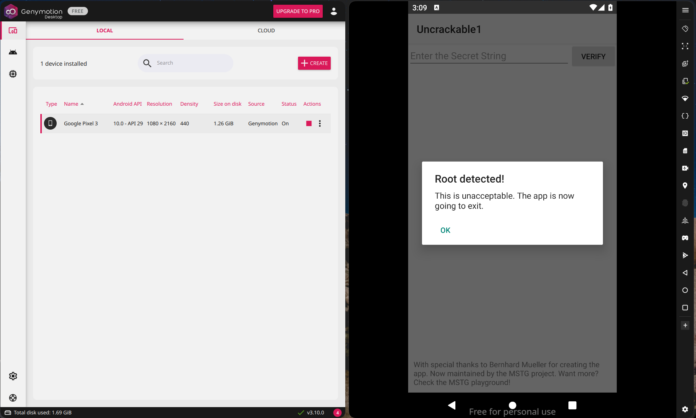
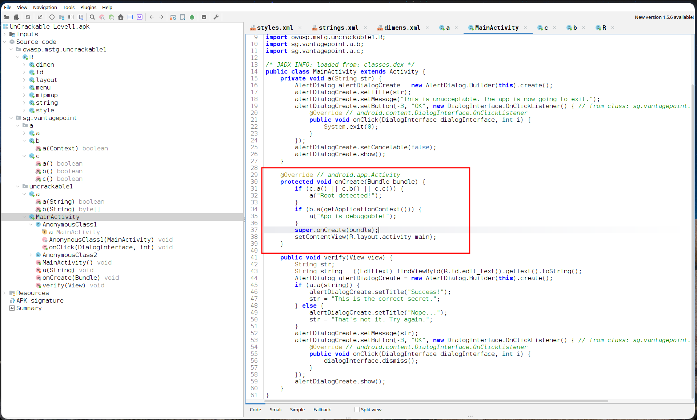
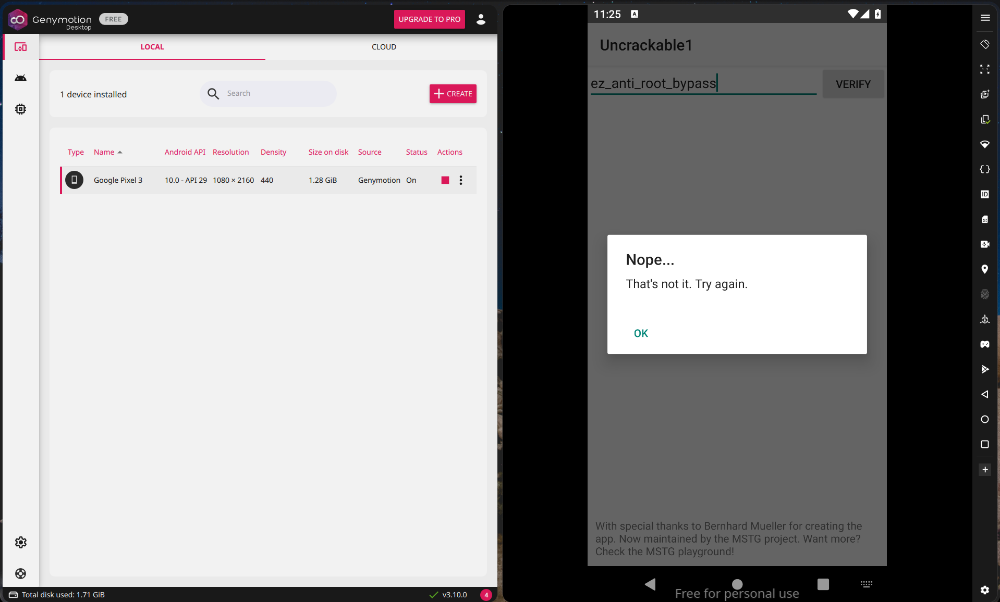
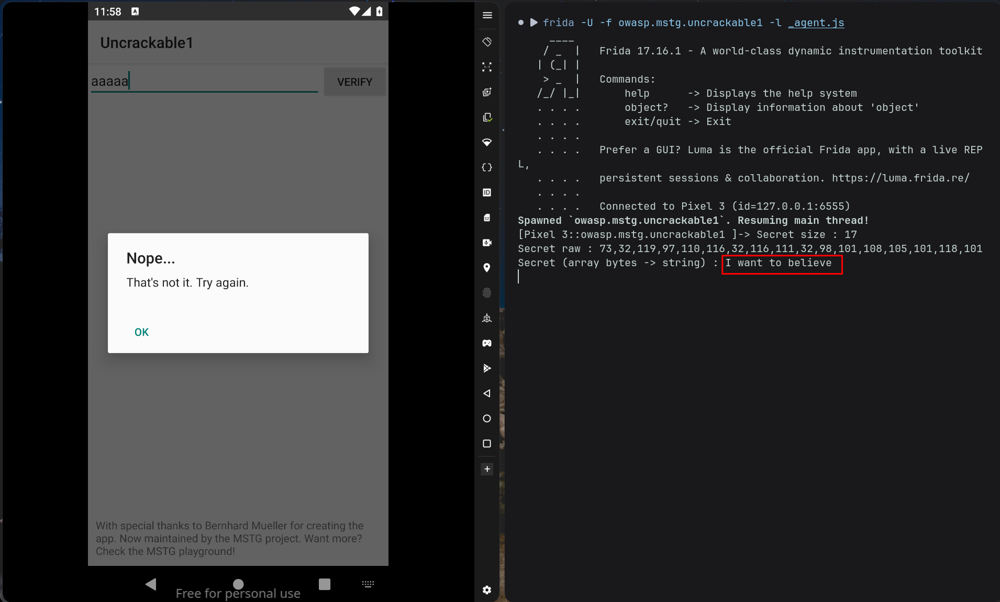

<style>
  .preview-img { display: none !important; }
</style>


# Android Uncrackable L1

<u>Statement</u> : A secret string is hidden somewhere in this app. Find a way to extract it.

This crackme is from the [OWASP MAS crackmes]( https://mas.owasp.org/crackmes/).

## Resources
Here are the resources I found useful during the reverse engineering and exploitation processes. 
- https://medium.com/@ahmedafatah/android-security-for-dummies-root-detection-695bd4d90db8
- https://droidwin.com/how-to-hide-su-file-and-magisk-file/
- https://stackoverflow.com/questions/18808705/android-root-detection-using-build-tags
- https://developer.android.com/reference/android/content/pm/ApplicationInfo#flags
- https://frida.re/docs/android/
- https://frida.re/docs/javascript-api


## I. First analysis
We get [this APK file](UnCrackable-Level1.apk) : 
```sh
$ file UnCrackable-Level1.apk 
UnCrackable-Level1.apk: Android package (APK), with AndroidManifest.xml, with APK Signing Block
```

So there's obviously the **AndroidManifest.xml** file containing the app metadata. The `file` command also shows the presence of the **APK Signing Block**. 

> [!NOTE] **APK Signing Block** 
> An APK Signing Block is a dedicated section within an APK. It stores the **app's cryptographic signatures and developer identity**, ensuring the app is authentic, hasn't been tampered with, and safely installs on the Android operating system.

We can install the APK file on our **emulated rooted device** : 
```sh
$ adb install UnCrackable-Level1.apk 
Performing Streamed Install
Success
```

While launching the app, we see it detects right away the device is rooted. 

  


## II. Static reverse with JADX

Let's inspect the source code in order to understand **how the root detection is made** so we'll be able to understand how to bypass it. 

By looking at the `onCreate` function (*the start of the app lifecycle*) we can see that **four verifications** are made before letting the user access the app. 



Now, we can look for the "`c`" class to see the **anti-root** protections. Here is the commented version :
```java
package sg.vantagepoint.a;

import android.os.Build;
import java.io.File;

public class c {
    // Searches in the PATH env variable directories for the "su" binary (meaning the device is rooted)
    public static boolean a() {
        for (String str : System.getenv("PATH").split(":")) {
            // str being a directory
            // checks if <directory>/su file exists
            // if it does, returns true
            if (new File(str, "su").exists()) {
                return true;
            }
        }
        return false;
    }

    // Checks if the OS was signed with test-keys
    public static boolean b() {
        String str = Build.TAGS;
        return str != null && str.contains("test-keys");
    }

    // Simply checks for the presence of any of the files declared in the String array
    public static boolean c() {
        for (String str : new String[]{"/system/app/Superuser.apk", "/system/xbin/daemonsu", "/system/etc/init.d/99SuperSUDaemon", "/system/bin/.ext/.su", "/system/etc/.has_su_daemon", "/system/etc/.installed_su_daemon", "/dev/com.koushikdutta.superuser.daemon/"}) {
            if (new File(str).exists()) {
                return true;
            }
        }
        return false;
    }
}
```

### 1. `c.a()` :  Protection via PATH analysis

Function code : 
```java
public static boolean a() {
    for (String str : System.getenv("PATH").split(":")) {
        if (new File(str, "su").exists()) {
            return true;
        }
    }
    return false;
}

```

To bypass this, let's first look at our PATH on our android device : 
```sh
$ adb shell 'echo $PATH'
/sbin:/system/sbin:/product/bin:/apex/com.android.runtime/bin:/system/bin:/system/xbin:/odm/bin:/vendor/bin:/vendor/xbin
```
After running this command, we can see which directories of our device path contains the `su` binary : 
```sh
$ adb shell 'for d in $(echo $PATH | tr ":" " "); do ls $d 2>/dev/null | grep "^su$" >/dev/null && echo $d; done'

/system/bin
/system/xbin
```

> Here are two ways of bypassing this. 
> 1. The easiest way : **Change the return value of this function** with Frida's ability to hook functions, so it returns `false` no matter what.
> 2. The hardest way : Install LSPosed Framework, Magisk. Then, flash the Shamiko module with Magisk...so the `/system/bin/su` and `/system/xbin/su` are hidden. It's heavy but works against real production apps. Here's a link to follow the process : https://droidwin.com/how-to-hide-su-file-and-magisk-file/


We'll go with the first way as the second one would require to setup the Android device with multiple apps/frameworks and this is overkill for such a crackme. 

### 2. `c.b()` : Protection via Build Tags
Function code : 
```java
public static boolean b() {
    String str = Build.TAGS;
    return str != null && str.contains("test-keys");
}
```
We can see the verification made on `Build.TAGS`

The [documentation](https://learn.microsoft.com/en-us/dotnet/api/android.os.build.tags?view=net-android-35.0) says the `android.os.Build.TAGS` is a **string** containing comma-separated tags describing the build, like "*unsigned*,*debug*". 

There's a post on Stackoverflow asking what is this root detection doing : 
- https://stackoverflow.com/questions/18808705/android-root-detection-using-build-tags

This method checks the `android.os.Build.TAGS` property to see if **the operating system was signed with `test-keys`** (typically used in [AOSP or custom ROMs](https://emteria.com/blog/aosp-rom)) instead of the official `release-keys` provided by device manufacturers.

However this approach is really unreliable for two reasons : 
1. **False positives**: If a user installs a custom OS like Graphene for privacy reasons, he'd get blocked for no reason while being perfectly legitimate. 
2. **False negatives**: Modern rooting solutions are "systemless", so they don't modify the build tags. So a rooted device could still display `release-keys` and bypass this protection.


As for `c.a()`, we'll just **override this method** for it to **return false**.

### 3. `c.c()` : Protection via existing files checking
This method checks if those files exist. If **at least one of them** does, it returns true. 
```java
public static boolean c() {
    for (String str : new String[]{"/system/app/Superuser.apk", "/system/xbin/daemonsu", "/system/etc/init.d/99SuperSUDaemon", "/system/bin/.ext/.su", "/system/etc/.has_su_daemon", "/system/etc/.installed_su_daemon", "/dev/com.koushikdutta.superuser.daemon/"}) {
        if (new File(str).exists()) {
            return true;
        }
    }
    return false;
}
```

File utility : 
- `/system/app/Superuser.apk`: The GUI application installed on the device to manage root permissions and prompt the user when an app requests access.
- `/system/xbin/daemonsu`: The background daemon process required by SuperSU to handle the actual root elevation requests.
- `/system/etc/init.d/99SuperSUDaemon`: A boot script that ensures the SuperSU daemon starts automatically every time the Android device powers on.
- `/system/bin/.ext/.su`: A hidden directory and binary location. Some older rooting methods placed the su binary here to hide it from basic checks that only scanned standard directories like `/system/bin/su`.
- `/system/etc/.has_su_daemon` & `/system/etc/.installed_su_daemon`: Hidden empty files acting as markers. The SuperSU installer creates them to flag that the system has been successfully rooted.
- `/dev/com.koushikdutta.superuser.daemon/`: A specific Unix socket or device node created by [Koushik Dutta's Superuser framework (ClockWorkMod)](https://www.clockworkmod.com/) to communicate with its background processes.


As we can see, all those files are particular cases, so this verification isn't really useful/strong. 


>[!TIP] The evolution of root hiding
> Like the [`Build.TAGS` check](#2-cb--protection-via-build-tags), looking for hardcoded paths is not effective against modern tools. **Frameworks like [Magisk](https://github.com/topjohnwu/Magisk) do not install their binaries or daemons in `/system` anymore**, making them completely invisible to this type of static scanning.

For a third time, we'll use Frida's ability to hook methods so `c.c()` returns false. 

### 4. `b.a()` : Anti-debug protection via application flags
We now can look for the "`b`" class as we know how to bypass the 3 anti-root protections we've just seen. 

```java
package sg.vantagepoint.a;

import android.content.Context;

/* JADX INFO: loaded from: classes.dex */
public class b {
    public static boolean a(Context context) {
        return (context.getApplicationContext().getApplicationInfo().flags & 2) != 0;
    }
}
```
What this method does is reading the 2<sup>nd</sup> least significant bit of the `flags` property and : 
- Returns *true* if the **flag is set**. 
- Returns *false* if the **flag is not set**.

After reading the [Android documentation](https://developer.android.com/reference/android/content/pm/ApplicationInfo#flags), we can see the flag located at the 2<sup>nd</sup> least significant bit is the `FLAG_DEBUGGABLE` constant. 

If the bit is set, it means that the application would like to allow debugging of its code. **It's not set by default as we didn't modify the app source code for it to be set**, so it's not allowing debugging. 

Once again, we'll hook this function with Frida so it returns false no matter what. 

## III. Function hooking with Frida JS API
We can use TypeScript to write our JS script so we'll get autocompletion for Frida syntax. 

### Setup

#### Scripting requirements

In order to be able to code in TS, we have to setup like this : 
```sh
$ git clone https://github.com/oleavr/frida-agent-example.git /tmp/temp_frida

$ cp -r /tmp/temp_frida/. .

$ rm -rf temp_frida .git
```


We now have to write our exploit script in `agent/index.ts`. 

> [!TIP] TypeScript Setup
> We can keep a separate terminal open and run `npm run watch`. This will automatically compile our TypeScript code into JavaScript in real time after each modification.
> 
> Also, we can add the following line at the very top of our `index.ts` file to enable IDE autocompletion and type definitions for the Frida and Java APIs:
> `/// <reference types="frida-gum" />`

#### Frida server
As our android device is rooted, we can simply install the [frida-server](https://github.com/frida/frida/releases/download/17.16.0/frida-server-17.16.0-android-x86.xz) on the device. 

Once again, we just have to follow what the documentation says : 
- https://frida.re/docs/android/

So it should look like that : 
```sh
$ adb root # incase
adbd is already running as root
$ ls
- frida-server-17.16.0-android-x86
$ mv frida-server-17.16.0-android-x86 frida-server
$ adb push frida-server /data/local/tmp/
frida-server: 1 file pushed, 0 ...MB/s (53935444 bytes in 0.164s)
$ adb shell "chmod 755 /data/local/tmp/frida-server"
$ adb shell "/data/local/tmp/frida-server &"
```
### Scripting the hooking

Now the server is running, let's write our script. 

The documentation is easy to understand. To hook a function, we do : 
```java
const classWeWant = Java.use('package.classname');
classWeWant.methodName.implementation = function () {
    // whatever we want here
}
```

Let's see if the anti-root protection message changes with this script, as it hooks the 3 anti root protection functions : 
```ts
/// <reference types="frida-gum" />

import Java from "frida-java-bridge";
import { log } from "./logger.js";

Java.perform(() => {
    const cClass = Java.use('sg.vantagepoint.a.c');
    cClass.a.implementation = function () {
        return false;
    }
    cClass.b.implementation = function () {
        return false;
    }
    cClass.c.implementation = function () {
        return false;
    }
})
```

We can use the command below to make frida itself start the application while injecting our script into the Java runtime. 
- `-U` : Tells Frida to connect to the USB plugged device. Here, the "usb plugged device" is recognized through ADB. 
- `-f owasp.mstg.uncrackable1` : Tells frida to start the application itself. If we did not use this option, **the anti-root detection would be effective even before our script is injected into the runtime**.  
- `-l _agent.js` : We use the `agent/index.ts` to write our code that is compiled into the `_agent.js` file. So this is the final script containing our exploit. 
```sh
$ frida -U -f owasp.mstg.uncrackable1 -l _agent.js
     ____
    / _  |   Frida 17.16.1 - A world-class dynamic instrumentation toolkit
   | (_| |
    > _  |   Commands:
   /_/ |_|       help      -> Displays the help system
   . . . .       object?   -> Display information about 'object'
   . . . .       exit/quit -> Exit
   . . . .
   . . . .   Prefer a GUI? Luma is the official Frida app, with a live REPL,
   . . . .   persistent sessions & collaboration. https://luma.frida.re/
   . . . .
   . . . .   Connected to Pixel 3 (id=127.0.0.1:6555)
Spawned `owasp.mstg.uncrackable1`. Resuming main thread!                
[Pixel 3::owasp.mstg.uncrackable1 ]->
```


Looking at our device, we can see **the anti root warning disappeared** and that we can now enter the string we want in the input field. Let's try a random string to see what message we now get. 



> [!IMPORTANT]
> We bypassed the anti-root protections. The anti-debug protection (application flags) was not triggered as we did not modify the APK, so no need to add a hook for it into our exploitation script. 

## Finding the secret

Now that we can do whatever we want on the app as we bypassed the protections, let's find the string to validate this crackme. 

This function is called whenever the user clicks on the "Verify" button. 
```java
public void verify(View view) {
    String str;
    String string = ((EditText) findViewById(R.id.edit_text)).getText().toString();
    AlertDialog alertDialogCreate = new AlertDialog.Builder(this).create();
    if (a.a(string)) {
        alertDialogCreate.setTitle("Success!");
        str = "This is the correct secret.";
    } else {
        alertDialogCreate.setTitle("Nope...");
        str = "That's not it. Try again.";
    }
    alertDialogCreate.setMessage(str);
    alertDialogCreate.setButton(-3, "OK", new DialogInterface.OnClickListener() { // from class: sg.vantagepoint.uncrackable1.MainActivity.2
        @Override // android.content.DialogInterface.OnClickListener
        public void onClick(DialogInterface dialogInterface, int i) {
            dialogInterface.dismiss();
        }
    });
    alertDialogCreate.show();
}
```

This is the interesting part. It takes the user input - the "`string`" variable - and calls the `sg.vantagepoint.uncrackable1.a.a(String str)` function.
```java
if (a.a(string)) {
    alertDialogCreate.setTitle("Success!");
    str = "This is the correct secret.";
}
```

Going into the "`a`" class of the `sg.vantagepoint.uncrackable1` package, we find this code for the "`a`" method : 
```java
package sg.vantagepoint.uncrackable1;

import android.util.Base64;
import android.util.Log;

/* JADX INFO: loaded from: classes.dex */
public class a {
    public static boolean a(String str) {
        byte[] bArrA;
        byte[] bArr = new byte[0];
        try {
            bArrA = sg.vantagepoint.a.a.a(b("8d127684cbc37c17616d806cf50473cc"), Base64.decode("5UJiFctbmgbDoLXmpL12mkno8HT4Lv8dlat8FxR2GOc=", 0));
        } catch (Exception e) {
            Log.d("CodeCheck", "AES error:" + e.getMessage());
            bArrA = bArr;
        }
        return str.equals(new String(bArrA));
    }
    
    ...
}
```
Instead of wasting time trying to understand the crypto operations, let's hook the `sg.vantagepoint.a.a.a` function so it directly prints the value it computes (the expected value for our input).

The method looks like this : 
```java
package sg.vantagepoint.a;

import java.security.InvalidKeyException;
import java.security.NoSuchAlgorithmException;
import javax.crypto.Cipher;
import javax.crypto.NoSuchPaddingException;
import javax.crypto.spec.SecretKeySpec;

/* JADX INFO: loaded from: classes.dex */
public class a {
    public static byte[] a(byte[] bArr, byte[] bArr2) throws NoSuchPaddingException, NoSuchAlgorithmException, InvalidKeyException {
        SecretKeySpec secretKeySpec = new SecretKeySpec(bArr, "AES/ECB/PKCS7Padding");
        Cipher cipher = Cipher.getInstance("AES");
        cipher.init(2, secretKeySpec);
        return cipher.doFinal(bArr2);
    }
}
```

We can append this at the end of our `agent/index.ts` : 
```ts
const aClass = Java.use('sg.vantagepoint.a.a');
aClass.a.implementation = function(arg1: any, arg2: any) {
    // By calling this.a() aka the method we're currently hooking we can execute the original code before the one we define gets executed
    const secret = this.a(arg1, arg2);

    // so we get a byte array 
    // let's convert it to a string
    var result = "";
    log("Secret size : " + secret.length);
    log("Secret raw : " + secret);
    for (var i = 0; i < secret.length; i++) {
        result += String.fromCharCode(parseInt(secret[i], 10));
    }

    log("Secret (array bytes -> string) : " + result);

    return secret;
}
```

By relaunching the script injection with frida and submitting a random input, we indeed get the computed secret !

  

```sh
I want to believe
```

