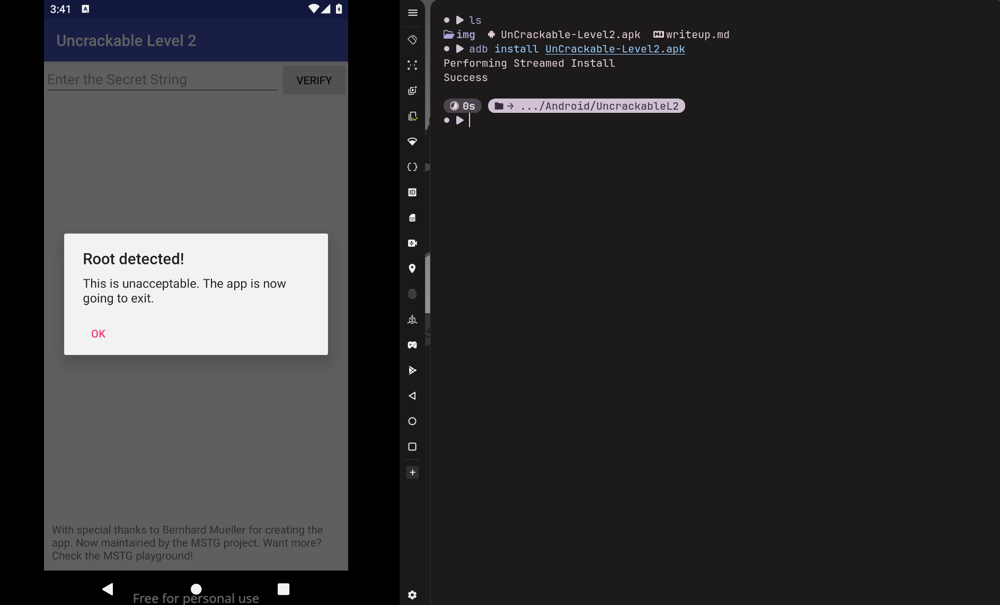
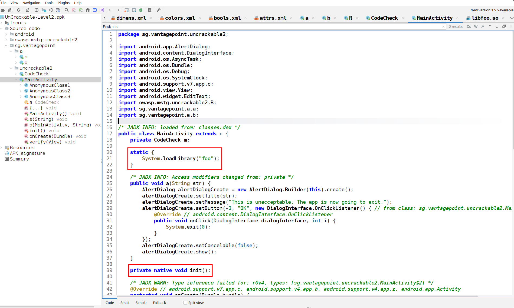
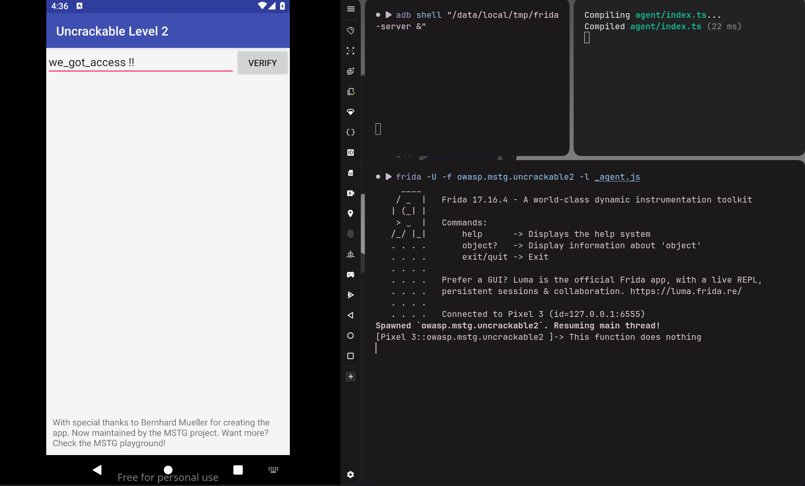
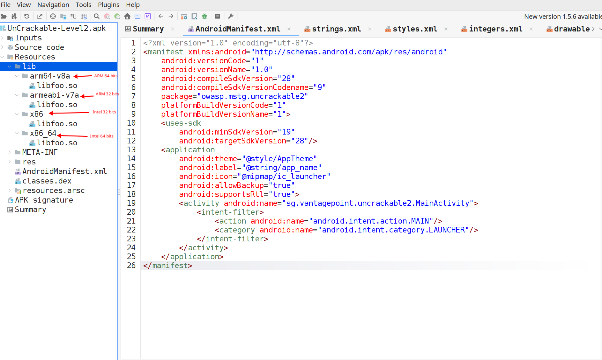
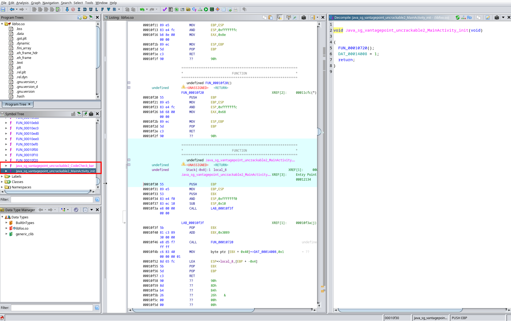
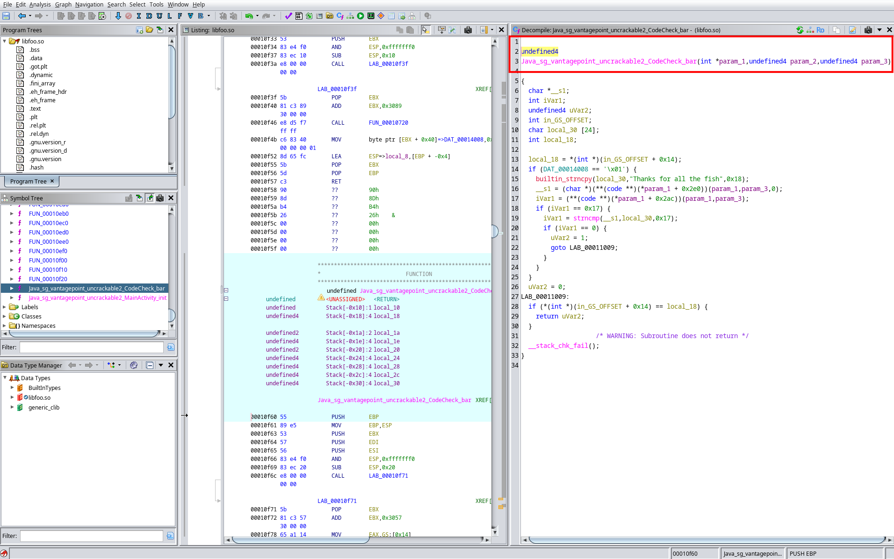
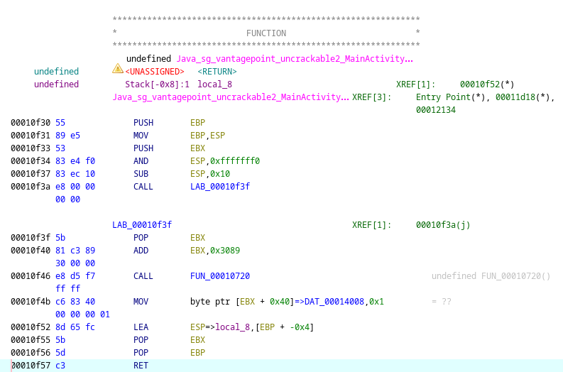
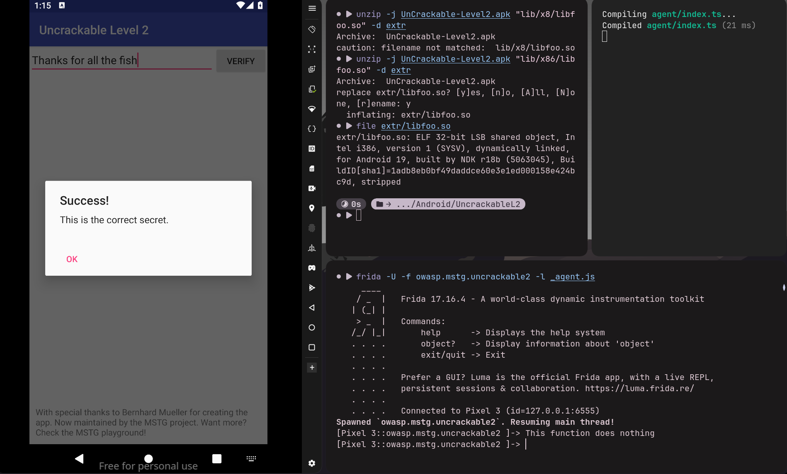

<style>
  .preview-img { display: none !important; }
</style>

# Android Uncrackable L2

> **Note**
>
> If you haven't checked yet, the UncrackableL1 writeup is available [here](https://naxyl.re/post/uncrackable-1/).
{.prompt-info}

<u>Statement</u>: This app holds a secret inside. May include traces of **native code**.

This crackme is from the [OWASP MAS crackmes](https://mas.owasp.org/crackmes/).


## Resources
Here are the resources I found useful during the reverse engineering and exploitation processes.
- https://developer.android.com/privacy-and-security/risks/use-of-native-code
- https://hacktricks.wiki/en/mobile-pentesting/android-app-pentesting/reversing-native-libraries.html


## I. First analysis
We get this APK file : 
```sh
$ file UnCrackable-Level2.apk 
UnCrackable-Level2.apk: Android package (APK), with AndroidManifest.xml, with APK Signing Block
```

Let's install the APK file on our **emulated root device** : 
```sh
$ adb install UnCrackable-Level2.apk 
Performing Streamed Install
Success
```

Like the first crackme, it detects that the device is rooted, and forces the user to exit the app. 

  


## II. Understanding Native Code
Before diving into the reverse engineering part, let's understand how **native code** works.

In the real world, developers use Android's Native Development Kit (NDK) to write C/C++ libraries for two main reasons. 
1. **Performance** (e.g., game engines, video processing).
2. **Security and obfuscation**, which is highly relevant to this crackme.

As we saw in [Level 1](https://naxyl.re/post/uncrackable-1/), Dalvik bytecode (*.dex classes*) is easily decompiled into **highly readable source code** using tools like JADX. Developers often move the critical code logic into **native libraries** (*.so files*) because compiled ARM (*or any other architecture*) assembly is drastically harder to reverse engineer than Java bytecode.


The official [Android documentation](https://developer.android.com/privacy-and-security/risks/use-of-native-code) explains that the use of native code also introduces **security risks** such as buffer overflows, format string vulnerabilities and integer overflows !

We could still ask ourselves a question : *How does a high-level language like Java communicate with such low level libraries ?*

> **Java Native Interface**
>
> The JNI enables Java code to call and be called by **native code**, **native applications** (programs specific to a hardware and OS) and **libraries** written in other languages such as C, C++ or even assembly.  
>
> We can see this as the "*bridge*" between the ART (Java VM) and native code (directly interacting with real memory and processor). 
{.prompt-info}


## III. Reversing the app 

### *MainActivity* class
After decompiling our APK file with JADX, let's take a look at the `MainActivity` class. 

  

The program first loads the  **native `libfoo.so`  library** and declares a native `init()` method. This function code is written directly within the `libfoo.so` library. 

It will later be called by the `onCreate` method at its very beginning. 
```java
@Override 
protected void onCreate(Bundle bundle) {
    init(); // call to the native library method
    if (b.a() || b.b() || b.c()) {
        a("Root detected!");
    }
    if (a.a(getApplicationContext())) {
        a("App is debuggable!");
    }

    new AsyncTask<Void, String, String>() { 
        @Override
        public String doInBackground(Void... voidArr) {
            while (!Debug.isDebuggerConnected()) {
                SystemClock.sleep(100L);
            }
            return null;
        }
        @Override
        public void onPostExecute(String str) {
            MainActivity.this.a("Debugger detected!");
        }
    }.execute(null, null, null);

    this.m = new CodeCheck();
    super.onCreate(bundle);
    setContentView(R.layout.activity_main);
}
```

If you read my article about [UncrackableL1](https://naxyl.re/post/uncrackable-1/), you must recognise the **anti-root** and **anti-debug** protections right after the `init()` call. 

If any of these 4 checks is triggered, the `MainActivity.a()` method is called and **forces the user to exit the app**. 
```java
// Method from MainActivity class
public void a(String str) {
    AlertDialog alertDialogCreate = new AlertDialog.Builder(this).create();
    alertDialogCreate.setTitle(str);
    alertDialogCreate.setMessage("This is unacceptable. The app is now going to exit.");
    alertDialogCreate.setButton(-3, "OK", new DialogInterface.OnClickListener() {
        @Override
        public void onClick(DialogInterface dialogInterface, int i) {
            System.exit(0); // Forces the user to exit whenever this method is called
        }
    });
    alertDialogCreate.setCancelable(false); // avoid the user to cancel the pop up so he's forced to exit
    alertDialogCreate.show();
}
```

> **Hooking the exit handler**
>
>We could easily bypass these just like the first crackme, but there's an even **faster way**! Instead of *individually* hooking `b.a()`, `b.b()`, `b.c()` and `a.a(getApplicationContext())`, we can directly hook the `MainActivity.a(String str)` so it does not force the user to exit the app anymore.
{.prompt-tip}

I already explained in the first writeup how to use Frida to *hook* functions, so here is the hooking code for the `MainActivity.a(String str)` function : 
```java
Java.perform(() => {
    // We first hook the exit handler function
    const MainActivity = Java.use('sg.vantagepoint.uncrackable2.MainActivity');
    // Overload is mandatory because of the asynchronous task in onCreate(...)
    MainActivity.a.overload('java.lang.String').implementation = function(param1: string){
        log("This function does nothing");
    }
})
```

> **Method overloading**
>
> As you can see, we had to use `overload()` on our `MainActivity.a` method before defining its new implementation. If we did not, this is the message Frida would give us : 
> ```
> Error: a(): has more than one overload, use .> overload(<signature>) to choose from:
> 	.overload('java.lang.String')
> 	.overload('sg.vantagepoint.uncrackable2.MainActivity', 'java.lang.String')
> ```
>
> How come Frida sees **two methods** while our decompiled code in JADX only shows **one**?  
> The answer lies in how Java handles **inner classes**. If we look closely at the `onCreate` method, the application uses an asynchronous task ([AsyncTask](https://developer.android.com/reference/kotlin/android/os/AsyncTask), *deprecated since Android API level 30*) in the background. From this inner class, it calls the `MainActivity.a()` method.
>
> However, because `a()` was originally declared as a `private` method, the inner class (`AsyncTask`) technically shouldn't have access to it at the bytecode level. To fix this, the Java compiler silently generates a hidden **synthetic bridge method** (taking the `MainActivity` instance as its first argument) to allow the connection.
>
> So while JADX is smart enough to hide this trick for the code to stay readable, **Frida hooks directly into the Dalvik VM memory and sees everything**. Therefore, we must explicitly use `.overload('java.lang.String')` to tell Frida exactly which one of the two methods we want to redefine !
{.prompt-info}

Let's try to inject this script and see if it bypasses these protections.




It does ! Also, notice how the `AsyncTask` protection is useless here ? At first we could believe it is due to the way we hooked `MainActivity.a(String str)` so it does not prompt anything. Actually, the `Debug.isDebuggerConnected` method checks if the **Java Debug Wire Protocol (JDWP) is active**. Since Frida injects itself **directly into the process memory**, it wouldn't trigger the JDWP detection at all.

Since all these protections were implemented on the Java side rather than in the native library, bypassing them was really easy. With the app now running freely, we can focus on finding the correct secret.


### *CodeCheck* and native library
Moving down to the end of `onCreate()`, we notice that a `CodeCheck` object is instantiated and stored in the `m` attribute
```java
@Override
protected void onCreate(Bundle bundle) {
    init();
    
    ... // anti-root & anti-debug protections 
    
    this.m = new CodeCheck();
    super.onCreate(bundle);
    setContentView(R.layout.activity_main);
}
```
Just like in the previous crackme, when the user submits their input, the `verify()` method is triggered. As we can see below, it retrieves the user's input from the text field and delegates the actual verification to our `CodeCheck` object by calling `this.m.a(string)`.
```java
public void verify(View view) {
    String str;
    String string = ((EditText) findViewById(R.id.edit_text)).getText().toString(); // gets the user input
    AlertDialog alertDialogCreate = new AlertDialog.Builder(this).create();
    if (this.m.a(string)) {
        alertDialogCreate.setTitle("Success!");
        str = "This is the correct secret.";
    } else {
        alertDialogCreate.setTitle("Nope...");
        str = "That's not it. Try again.";
    }
    alertDialogCreate.setMessage(str);
    alertDialogCreate.setButton(-3, "OK", new DialogInterface.OnClickListener() { // from class: sg.vantagepoint.uncrackable2.MainActivity.3
        @Override // android.content.DialogInterface.OnClickListener
        public void onClick(DialogInterface dialogInterface, int i) {
            dialogInterface.dismiss();
        }
    });
    alertDialogCreate.show();
}
```
Let's take a look at the `CodeCheck` class.
```java
package sg.vantagepoint.uncrackable2;

/* JADX INFO: loaded from: classes.dex */
public class CodeCheck {
    private native boolean bar(byte[] bArr);

    public boolean a(String str) {
        return bar(str.getBytes());
    }
}
```
When `a()` is called, it simply converts the user input into a byte array and passes it to the **native method** `bar().` This is where the interesting part begins!

In order to understand the logic behind `bar()`, we have to reverse the `libfoo.so` native library.

While looking for the library in `Resources/lib` in JADX, four versions of the library are available :   
  


> **Choosing the library architecture**
> 
> In order to choose the correct library to reverse we must select **the one that matches the architecture** of the device we are running the APK on. Since we're running the app on an `x86` emulator, we should extract and analyze the `x86` version of `libfoo.so`.
{.prompt-tip}

We can grab the library of the architecture we want with this command : 
```sh
$ unzip -j UnCrackable-Level2.apk "lib/x86/libfoo.so" -d extr
Archive:  UnCrackable-Level2.apk
  inflating: extr/libfoo.so     
```

### Static analysis of `libfoo.so`
Let's look at the file, which is a classic ELF library. It's obviously stripped but we'll see how this is not a problem.
```sh
$ file extr/libfoo.so 
extr/libfoo.so: ELF 32-bit LSB shared object, Intel i386, version 1 (SYSV), dynamically linked, for Android 19, built by NDK r18b (5063045), BuildID[sha1]=1adb8eb0bf49daddce60e3e1ed000158e424bc9d, stripped
```

Let's open it with Ghidra. We can see a lot of stripped functions and the 2 native functions declared in the `MainActivity` Java source code. 




#### The JNI calling convention

If we look at `init(void)` in the top right corner of the screen, the **function signature** is the same : no argument. This looks normal at first but wait a bit...

In our Java code, `bar(byte[] bArr)` only takes **one argument**. However, its corresponding function in the native library (`Java_sg_vantagepoint_uncrackable2_CodeCheck_bar`) is shown taking **three arguments** !





This brings us back to the core concept of the **JNI** as previously mentionned in the ["Understanding Native Code" part](#ii-understanding-native-code). When the Android Virtual Machine calls a native C/C++ function, it doesn't just send the arguments defined in the Java code method signature. It silently injects **two mandatory implicit parameters** at the very beginning of the call :
1. `JNIEnv *env`: A pointer to the JNI environment. Basically, it's **the API that allows C code to interact back with Java** (*instantiate classes, read strings, extract arrays, etc.*).
2. `jobject thiz` (or `jclass`): The reference to the calling Java object (we can see it as **the equivalent** of `this` in Java).

Knowing this rule, the 3 parameters on our `bar(...)` function suddenly makes sense:
- 2 implicit arguments relative to the JNI + 1 explicit argument (our byte array).

The question we can ask ourselves now is : *Why doesn't the `init()` method have these 2 JNI related arguments ?* 

If we look at the assembly code of the `init()` function, we can see that none of the two first JNI related parameters are used (*we're in `x86 32-bit` so function parameters are passed by being pushed on the stack*). This is why Ghidra does not display them. 

  

#### Getting the secret
This crackme was not really fun as the flag was hardcoded in the `bar()` function code :( 

This is what we have after correctly renaming the variables : 
```c
// We remember from JADX that bar() returns a boolean
int32
Java_sg_vantagepoint_uncrackable2_CodeCheck_bar(int *param_1, undefined4 param_2, undefined4 user_input)

{
    char *user_input_unchanged; 
    int iVar1;
    undefined4 is_user_input_correct;
    int in_GS_OFFSET;
    char secret_string[24];
    int local_18;

    // Stack canary
    local_18 = *(int *)(in_GS_OFFSET + 0x14);
    if (DAT_00014008 == '\x01') // This is set to 1 only if the function called by init() does not detect any debugger. We bypassed this by hooking MainActivity.a() so it does not force the user to exit. (useless protection in this case)
    {
        // Instanciates the secret string
        builtin_strncpy(secret_string, "Thanks for all the fish", 0x18);
        // extract the raw bytes from the user_input and stores in a *char
        // We'll see how to understand this specific line in UncrackableL3
        user_input_unchanged = (char *)(**(code **)(*param_1 + 0x2e0))(param_1, user_input, 0);
        // gets the user_input length
        iVar1 = (**(code **)(*param_1 + 0x2ac))(param_1, user_input);
        // checks if the user input length is 23
        if (iVar1 == 0x17)
        {
            // compares secret string and user input 
            iVar1 = strncmp(user_input_unchanged, secret_string, 0x17);
            // if they correspond
            if (iVar1 == 0)
            {
                // the return value is set to true
                is_user_input_correct = 1;
                goto LAB_00011009;
            }
        }
    }
    // in any other case, the return value is set to false
    is_user_input_correct = 0;
LAB_00011009:
    if (*(int *)(in_GS_OFFSET + 0x14) == local_18)
    {
        return is_user_input_correct;
    }
    /* WARNING: Subroutine does not return */
    __stack_chk_fail();
}
```
To confirm the interpretation of this pseudo-code, let's try to submit this exact input : "Thanks for all the fish".

  


I'm pretty unhappy about the situation as we could have seen : 
1. How to setup ghidra so it recognises precises JNI API functions calls in the native code. 
2. How to hook native functions.

We'll probably see this in the [UncrackableL3](https://naxyl.re/post/uncrackable-3/), so don't mind checking it !

