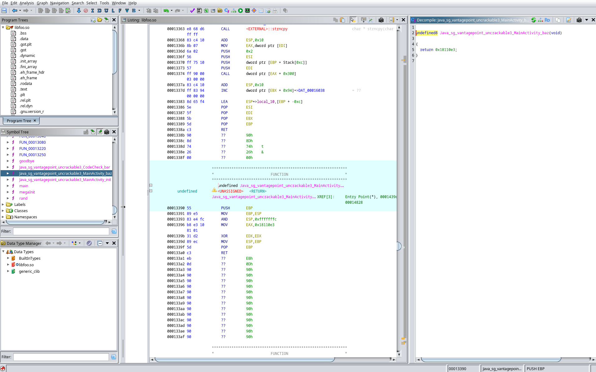
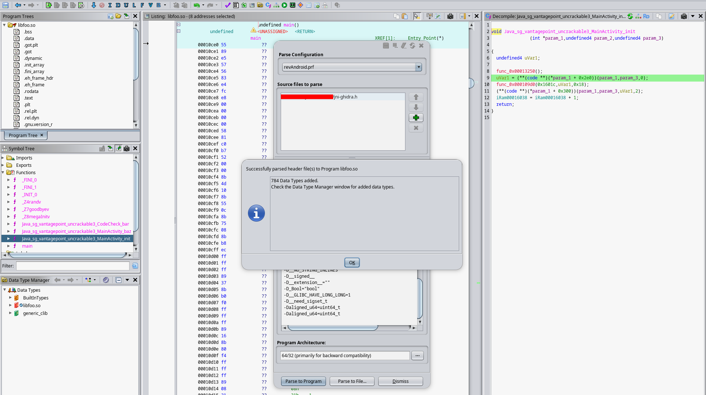
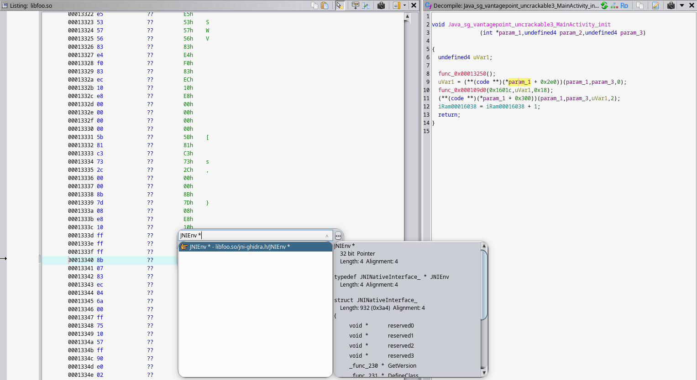
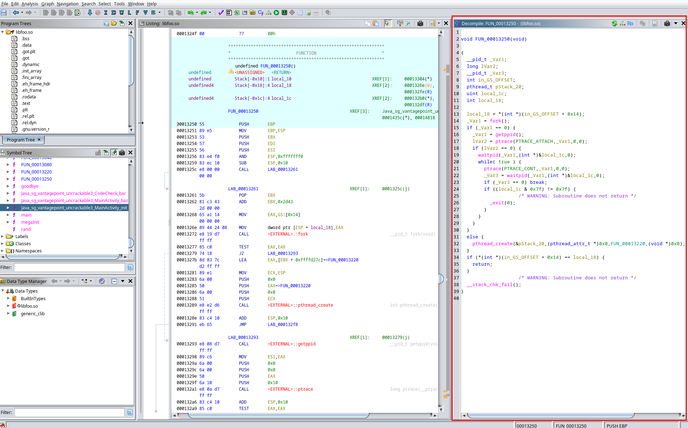
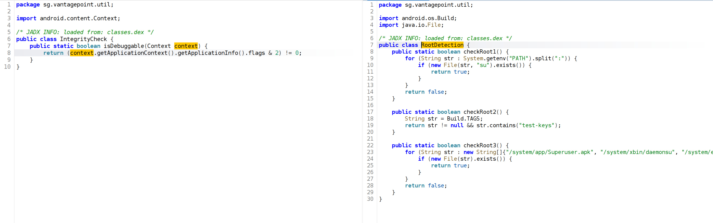
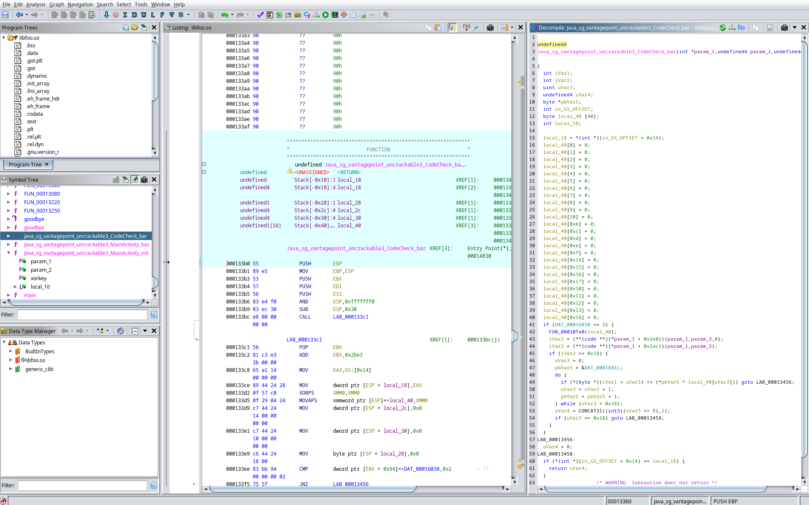
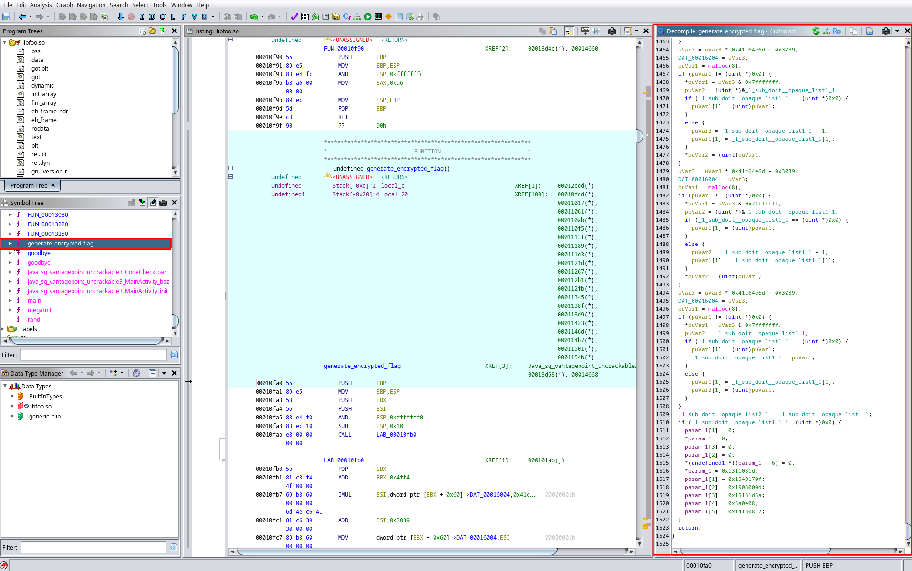
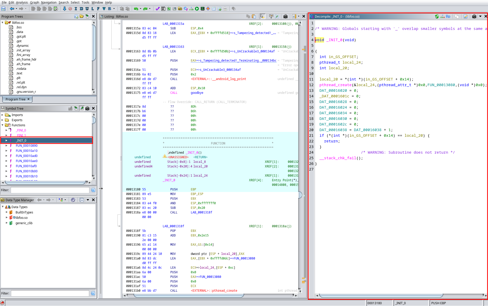
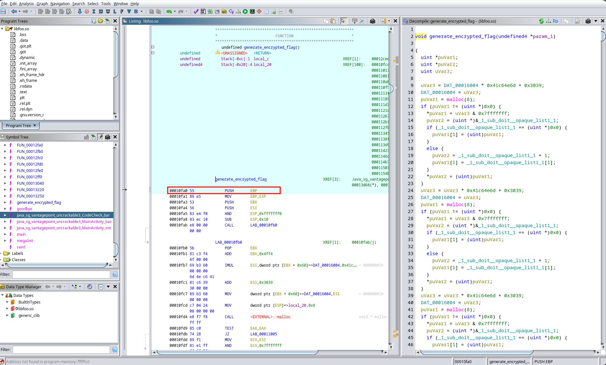

<style>
  .preview-img { display: none !important; }
</style>

# Android UncrackableL3

> **Note**
>
> This crackme is the sequel of the [UncrackableL1](https://naxyl.re/post/uncrackable-1/) and [UncrackableL2](https://naxyl.re/post/uncrackable-2/) crackmes. This writeup is way more complete, and references some parts of the two previous ones. Feel free to check them!
>
> Also, if some parts are unclear, you can contact me and help me improve this article!
{.prompt-info}

<u>Statement</u>: The crackme from hell! A secret string is hidden somewhere in this app. Find a way to extract it.


This crackme is from the [OWASP MAS crackmes](https://mas.owasp.org/crackmes/).


## Resources
- https://developer.android.com/jetpack/androidx/releases/versionedparcelable?hl=en
- https://developer.android.com/jetpack/androidx
- https://docs.oracle.com/javase/8/docs/api/java/util/zip/ZipEntry.html#getCrc--
- https://docs.oracle.com/en/java/javase/21/docs/specs/jni/types.html
- https://docs.oracle.com/en/java/javase/24/docs/specs/jni/functions.html#getprimitivetypearrayelements-routines
- https://docs.google.com/spreadsheets/d/1yqjFaY7mqyVIDs5jNjGLT-G8pUaRATzHWGFUgpdJRq8
- https://github.com/extremecoders-re/ghidra-jni
- https://developer.android.com/ndk/guides/jni-tips

TODO: Add some more resources.

## I. First analysis

We get a classic APK file, as usual. 
```sh
$ file UnCrackable-Level3.apk 
UnCrackable-Level3.apk: Android package (APK), with MANIFEST.MF and classes.dex
```


Installing the APK: 
```sh
$ adb install UnCrackable-Level3.apk 
Performing Streamed Install
Success
```

## II. `MainActivity` class overview
This time, unlike the two previous crackmes, the methods and attributes names are not "obfuscated" (*their names correspond to what they actually do*).
```java
package sg.vantagepoint.uncrackable3;

...

/* JADX INFO: loaded from: classes.dex */
public class MainActivity extends AppCompatActivity {
    private static final String TAG = "UnCrackable3";
    // If this has another value than 0, it means some of the APK files have been tampered
    static int tampered = 0;
    private static final String xorkey = "pizzapizzapizzapizzapizz";
    private CodeCheck check;
    // Associate a library name (architecture) to its checksum
    Map<String, Long> crc;

    // Native libfoo.so function
    private native long baz();

    // Native libfoo.so function
    private native void init(byte[] bArr);

    /* JADX INFO: Access modifiers changed from: private */
    public void showDialog(String str) {
        AlertDialog alertDialogCreate = new AlertDialog.Builder(this).create();
        ...
        alertDialogCreate.show();
    }

    private void verifyLibs() {
        this.crc = new HashMap();
        ...
    }

    @Override // android.support.v7.app.AppCompatActivity, android.support.v4.app.FragmentActivity, android.support.v4.app.SupportActivity, android.app.Activity
    protected void onCreate(Bundle bundle) {
        verifyLibs();
        ...
        setContentView(owasp.mstg.uncrackable3.R.layout.activity_main);
    }

    public void verify(View view) {
        String string = ((EditText) findViewById(owasp.mstg.uncrackable3.R.id.edit_text)).getText().toString();
        ...
        alertDialogCreate.show();
    }

    static {
        System.loadLibrary("foo");
    }
}
```
We can see the declaration of two native functions: 
- `private native long baz()`: Used in the `verifyLibs()` method to get a checksum value.
- `private native void init(byte[] bArr)`: Used in the `onCreate()` method, taking the `xorkey` class attribute as its parameter.

The `showDialog()` method is the equivalent of the `MainActivity.a()` method in the previous crackmes: When called, it displays the string passed as a parameter and then **forces the user to exit the app** with a non-cancellable pop-up.


The `verifyLibs()` method performs integrity checks, which we will dive into shortly.

And obviously, we can find the usual methods such as `onCreate()` (*the app entry point*) and `verify()` whose role is to check if the user input is correct.

And don't forget, at the end of the class we can see the `libfoo` library being loaded.

## III. App initialization
Let's first look at the entry point of the Android application: the `onCreate()` method!

```java
@Override // android.support.v7.app.AppCompatActivity, android.support.v4.app.FragmentActivity, android.support.v4.app.SupportActivity, android.app.Activity
protected void onCreate(Bundle bundle) {
    verifyLibs();
    init(xorkey.getBytes());
    new AsyncTask<Void, String, String>() { // from class: sg.vantagepoint.uncrackable3.MainActivity.2
        /* JADX INFO: Access modifiers changed from: protected */
        @Override // android.os.AsyncTask
        public String doInBackground(Void... voidArr) {
            while (!Debug.isDebuggerConnected()) {
                SystemClock.sleep(100L);
            }
            return null;
        }

        /* JADX INFO: Access modifiers changed from: protected */
        @Override // android.os.AsyncTask
        public void onPostExecute(String str) {
            MainActivity.this.showDialog("Debugger detected!");
            System.exit(0);
        }
    }.execute(null, null, null);
    if (RootDetection.checkRoot1() || RootDetection.checkRoot2() || RootDetection.checkRoot3() || IntegrityCheck.isDebuggable(getApplicationContext()) || tampered != 0) {
        showDialog("Rooting or tampering detected.");
    }
    this.check = new CodeCheck();
    super.onCreate(bundle);
    setContentView(owasp.mstg.uncrackable3.R.layout.activity_main);
}
```
First, it calls `verifyLibs()`, so let's understand how it works! 

### 1. `verifyLibs()` protection
This method checks for the libraries and `classes.dex` **integrity**, so it detects if any of them has been tampered.

The class attribute `tampered` is initialized to `0`, but can be set to a different value (`31337`) in this method if any of the library or `classes.dex` has been tampered.
```java
private void verifyLibs() {
    this.crc = new HashMap();
    // Sets the HashMap values for the 4 libraries versions (ARM 32/64-bit, x86 32/64-bits)
    this.crc.put("armeabi-v7a", Long.valueOf(Long.parseLong(getResources().getString(owasp.mstg.uncrackable3.R.string.armeabi_v7a))));
    this.crc.put("arm64-v8a", Long.valueOf(Long.parseLong(getResources().getString(owasp.mstg.uncrackable3.R.string.arm64_v8a))));
    this.crc.put("x86", Long.valueOf(Long.parseLong(getResources().getString(owasp.mstg.uncrackable3.R.string.x86))));
    this.crc.put("x86_64", Long.valueOf(Long.parseLong(getResources().getString(owasp.mstg.uncrackable3.R.string.x86_64))));
    try {
        ZipFile zipFile = new ZipFile(getPackageCodePath());
        // Checks for libraries integrity
        for (Map.Entry<String, Long> entry : this.crc.entrySet()) {
            String str = "lib/" + entry.getKey() + "/libfoo.so";
            ZipEntry entry2 = zipFile.getEntry(str);
            Log.v(TAG, "CRC[" + str + "] = " + entry2.getCrc());
            if (entry2.getCrc() != entry.getValue().longValue()) {
                tampered = 31337;
                Log.v(TAG, str + ": Invalid checksum = " + entry2.getCrc() + ", supposed to be " + entry.getValue());
            }
        }
        // Checks for classes.dex integrity
        ZipEntry entry3 = zipFile.getEntry("classes.dex");
        Log.v(TAG, "CRC[classes.dex] = " + entry3.getCrc());
        if (entry3.getCrc() != baz()) {
            tampered = 31337;
            Log.v(TAG, "classes.dex: crc = " + entry3.getCrc() + ", supposed to be " + baz());
        }
    } catch (IOException unused) {
        Log.v(TAG, "Exception");
        System.exit(0);
    }
}
```
It instantiates a *HashMap* using the **architecture version** of the lib as the key, and the **checksum** as the value. The checksums are hardcoded in the `Resources/resources.arsc/res/value/strings.xml` so we can extract them and see what is expected: 
```xml
<string name="armeabi_v7a">881998371</string>
<string name="arm64_v8a">1608485481</string>
<string name="x86">1618896864</string>
<string name="x86_64">2856060114</string>
```

Knowing this, the map will look like this: 
```java
<"armeabi_v7a", 881998371>, <"arm64_v8a", 1608485481>, <"x86", 1618896864>, <"x86_64", 2856060114>
```

> **CRC**
>
> A [Cyclic Redundancy Check](https://docs.oracle.com/javase/8/docs/api/java/util/zip/ZipEntry.html#getCrc--) is a smart, math-based checksum used to detect accidental data errors in digital networks and storage devices. Standard checksums just add bytes together, so they miss errors if bits swap places (*e.g., 1+2=3 and 2+1=3*). CRC is **highly position-sensitive**.
{.prompt-info}

1. It first checks for the libraries' checksums (only for the four architectures we can see above). 

2. Then, it checks for the `classes.dex` checksum. The computed checksum of `classes.dex` must be equal to the value the `baz()` **native function** returns.

Looking at its code after decompiling `libfoo.so`, it simply returns `0x18110e3` which is equal to `25235683`.
```c
undefined8 Java_sg_vantagepoint_uncrackable3_MainActivity_baz(void)

{
  return 0x18110e3;
}
```

You may wonder how to get the code of a native function like `baz()`. We have to **extract the native library from the APK**, and then **decompile it** with tools like Ghidra, IDA Pro, etc.

## IV. Reversing a native library

> **Java Native Interface** 
>
> This part will be a bit harsh, but I really recommend following it along, as it explains key principles for the JNI API and also how to set up Ghidra to enhance the reverse experience. 
{.prompt-info}


As we're running our APK on an **x86 32-bit** emulated device, we must extract the `x86` version of the library.

We can do so with this command: 
```sh
unzip -j UnCrackable-Level3.apk "lib/x86/libfoo.so" -d extracted_lib/
Archive:  UnCrackable-Level3.apk
  inflating: extracted_lib/libfoo.so  
```

Once we have extracted the library, let's open it with Ghidra and run the auto-analysis. 

  

As we just saw, the code of the `baz()` function is quite simple since it only returns a *long integer*. But what about more advanced functions that actually use the **JNI** in their code?

For instance, let's dive into the `init()` function that is called right after `verifyLibs()` in the `onCreate()` method.

### 1. `init(xorkey)` native function

When `init()` is called, it takes **the bytes** of the `MainActivity.xorkey` attribute as a parameter: 
```java
init(xorkey.getBytes());
```

We can easily find its value using JShell: 
```sh
jshell> String xorkey = "pizzapizzapizzapizzapizz";
xorkey ==> "pizzapizzapizzapizzapizz"

jshell> java.util.Arrays.toString(xorkey.getBytes());
$2 ==> "[112, 105, 122, 122, 97, 112, 105, 122, 122, 97, 112, 105, 122, 122, 97, 112, 105, 122, 122, 97, 112, 105, 122, 122]"
```

> **JShell**
>
> In order to execute short Java expressions/instructions without having to create classes or methods, we can use the `jshell` command! An [online version](https://onecompiler.com/jshell) exists too!
{.prompt-tip}

### 2. Setting up Ghidra for the JNI

If we compare the **Java method signature** with the **C function signature** generated by Ghidra, something feels off:
- Java: `init(byte[] bArr)` -> **1** parameter.
- C: `init(int *param_1, undefined4 param_2, undefined4 param_3)` -> **3** parameters.
```c
void Java_sg_vantagepoint_uncrackable3_MainActivity_init(int *param_1, undefined4 param_2, undefined4 param_3)

{
    char *__src;

    FUN_00013250();
    __src = (char *)(**(code **)(*param_1 + 0x2e0))(param_1, param_3, 0);
    strncpy(&DAT_0001601c, __src, 0x18);
    (**(code **)(*param_1 + 0x300))(param_1, param_3, __src, 2);
    DAT_00016038 = DAT_00016038 + 1;
    return;
}
```
This is due to the [**JNI calling convention**](https://docs.oracle.com/en/java/javase/24/docs/specs/jni/design.html). When the JVM calls a native C/C++ function, it silently passes **two implicit arguments** at the very beginning:
- `JNIEnv *env` (*here `param_1`*): A pointer to the JNI environment, which is basically **an API allowing C code to interact with Java** (*read strings, extract arrays, etc.*).
- `jobject thiz` (*here `param_2`*): The **reference to the calling Java object** (*the equivalent of `this` in Java*).

Therefore, `param_3` is our actual explicit argument: the `byte[]` array containing our `xorkey`.

Knowing this, let's look at this ugly line of code:
```c
__src = (char *)(**(code **)(*param_1 + 0x2e0))(param_1,param_3,0);
```
Since `param_1` is our `JNIEnv *` pointer, this line is actually **making an API call** to the Java environment. In C, the `JNIEnv` structure is just a **massive list of pointers to hundreds of JNI functions**. The compiler just tells the processor: "Take the base address of the `JNIEnv` pointer (`param_1`), add an offset of `0x2e0` bytes, and execute the function located there".

Since we are reversing a **32-bit** architecture, pointers are **4 bytes long**. If we divide the offset `0x2e0` (*736 in decimal*) by 4, we get **184**. This means the code is calling the **184th function** of the JNI structure. If we look at [this JNI cheatsheet](https://docs.google.com/spreadsheets/d/1yqjFaY7mqyVIDs5jNjGLT-G8pUaRATzHWGFUgpdJRq8), the 184th function is `GetByteArrayElements`.

Computing these offsets manually is annoying and can lead to **inattention errors**. Luckily, we can tell Ghidra to do this work for us by **providing it with the official `jni.h` header file**.

We can download this file from the [extremecoders-re/ghidra-jni repo](https://github.com/extremecoders-re/ghidra-jni).

The *README.md* of the repository explains very well how to set it up (*it's really easy*), so it's not really relevant to explain it here.

After setting it up, we can parse the program using this new source. 

  

The last step (*congrats if you made it here!*) is to change the data type of `param_1` to `JNIEnv *` so Ghidra's decompiler will reveal the actual JNI function names!  



As you can see, it perfectly worked and now the code changed a bit (*types such as `jbyte`, `jbyteArray`, etc.*), making it easier to read with the right function name! 
```c
void Java_sg_vantagepoint_uncrackable3_MainActivity_init(JNIEnv *param_1, undefined4 param_2, jbyteArray xorkey)

{
    jbyte *__src;
    FUN_00013250();
    __src = (*(*param_1)->GetByteArrayElements)(param_1, xorkey, (jboolean *)0x0);
    strncpy(&DAT_0001601c, __src, 0x18);
    (*(*param_1)->ReleaseByteArrayElements)(param_1, xorkey, __src, 2);
    DAT_00016038 = DAT_00016038 + 1;
    return;
}
```

### 3. Native-side initialization

What `init()` does is:
1. Calls a *really particular* **anti-debugging** function we'll [dissect shortly](#fun_00013250-anti-debug-protection).
```c
FUN_00013250();
```


2. Gets a pointer (`__src`) to the `xorkey` string **in the native world**. The [Oracle documentation](https://docs.oracle.com/en/java/javase/24/docs/specs/jni/functions.html#getprimitivetypearrayelements-routines) allows us to understand how the `GetByteArrayElements()` call works. 
```c
__src = (*(*param_1)->GetByteArrayElements)(param_1,xorkey,(jboolean *)0x0);
```

> **`Get<PrimitiveType>ArrayElements`**
>
> You may be wondering: *Why would we need to call `GetByteArrayElements` to get a pointer to the `xorkey` string, when the `xorkey` parameter already seems to be one?*
> 
> In the JNI, a `jbyteArray` (the type of the `xorkey` parameter in the C code) is not a raw memory pointer. It acts as an **opaque reference**, like a "ticket" or an identifier managed by the JVM.
>
> Because the Java Garbage Collector constantly moves objects around to optimize memory, **native code cannot safely access them directly**. `GetByteArrayElements` essentially hands this ticket to the JVM and **asks for a locked, raw C pointer** (`jbyte *`) in return, ensuring the integrity of the object. You can read more about this [here](https://developer.android.com/ndk/guides/jni-tips#primitive-arrays) and [here](https://developer.android.com/ndk/guides/jni-tips#local-and-global-references)
{.prompt-tip}


3. After retrieving a raw C pointer to the `xorkey` bytes, it copies the **24 bytes** of the key into the library's static memory (`DAT_0001601c`).
```c
strncpy(&DAT_0001601c,__src,0x18);
```

4. Calls the JNI API `ReleaseByteArrayElements()` function. Its documentation is also [here](https://docs.oracle.com/en/java/javase/24/docs/specs/jni/functions.html#releaseprimitivetypearrayelements-routines). It is mandatory to call this function to **tell the JVM that the native code is done with the pointer**, allowing the Garbage Collector to safely free the memory copy.
```c
(*(*param_1)->ReleaseByteArrayElements)(param_1,xorkey,__src,2);
```

5. Increments a specific memory space (`DAT_00016038`) by `1`, which is sort of **a flag that will be later checked by the program**. 
```c
DAT_00016038 = DAT_00016038 + 1;
```

### `FUN_00013250`: Anti-debug protection... or not 
Now that we understand the `init(xorkey)` code, we need to understand the "protection" it uses before copying the xorkey in memory. The code looks a bit confusing at first: 

  

This is the function code after renaming it and its variables. In order to be able to fully understand the code, I recommend paying attention to the comments I put as well as reading the `man` pages for these syscalls:
- `ptrace`
- `waitpid`
```c
void flawed_anti_debug(void) {
    __pid_t pid;
    long is_pid_already_traced;
    __pid_t is_parent_still_alive;
    int in_GS_OFFSET;
    pthread_t pStack_20;
    uint wstatus;
    int stack_canary;

    // Stack canary init
    stack_canary = *(int *)(in_GS_OFFSET + 0x14);
    // Creates a new process, fork() call either returns 0 (child process), or the parent pid
    pid = fork();
    // This condition jump depends on which process is running the code (parent or child, both will come across this code)
    if (pid == 0) { 
        // If it's the child running it, retrieves the child parent's pid
        pid = getppid();
        // The child attaches itself to its parent. It sends SIGSTOP to the parent so the parent freezes
        is_pid_already_traced = ptrace(PTRACE_ATTACH, pid, 0, 0);
        // If the previous step succeeds (the child has successfully traced its parent), it returns 0
        // Otherwise, if the parent is already being traced, there's no fallback, that's a flaw !!! This doesn't prevent the parent from being traced by another process than its child (debugger for example)
        if (is_pid_already_traced == 0) {
            // Waits for the parent to be indeed frozen after the PTRACE_ATTACH call
            waitpid(pid, (int *)&wstatus, 0);
            while (true) {
                // Now the child is sure its parent is frozen, it can tell it to continue its work (remember the parent id is the app pid)
                ptrace(PTRACE_CONT, pid, 0, 0);
                // The child waits for the parent to stop (e.g., if a debugger tries to attach and sends SIGSTOP) or to terminate
                is_parent_still_alive = waitpid(pid, (int *)&wstatus, 0);
                // If the parent is not alive anymore, it exits the while loop as the child has no more tracing to block (supposedly because obviously there's a flaw in the PTRACE_ATTACH verification)
                if (is_parent_still_alive == 0)
                    break;
                // If the previous waitpid call triggers another wstatus than WIFSTOPPED, it means the parent crashed or terminated normally, so the child exits as it has nothing to do anymore 
                if ((wstatus & 0x7f) != 0x7f) {
                    /* WARNING: Subroutine does not return */
                    _exit(0);
                }
            }
        }
    }
    else { // If it's the parent running the code, it creates a new thread and calls a handmade exit function (that only calls pthread_exit) on this same thread...so it's pointless
        pthread_create(&pStack_20, (pthread_attr_t *)0x0, pthread_exit_alias, (void *)0x0);
    }
    // Checks if the stack canary has been changed during the function (avoids ret2win etc.)
    if (*(int *)(in_GS_OFFSET + 0x14) == stack_canary)
    {
        return;
    }
    /* WARNING: Subroutine does not return */
    __stack_chk_fail();
}
```

> **`PTRACE_ATTACH` flaw**
>
> The core idea behind this anti-debug trick relies on a strict Linux rule: **a process can only have one tracer attached to it at a time**. The child process tries to occupy this "debugger slot" to prevent us from debugging the app. If we are already debugging the application with an external tool, the child's `ptrace(PTRACE_ATTACH)` call will **fail and return -1**.
>
> However! If we look closely at the `if (is_pid_already_traced == 0)` condition, we can spot a huge flaw. **If the attachment fails, the child process does absolutely nothing**! Because of this missing fallback, the protection bypasses itself and allows us to trace the parent process without even being blocked/making the program crash...
{.prompt-warning}


## V. Java-side anti-root/anti-debug protections
Getting back to the decompiled Java code of the `onCreate()` function, we can see the same protections as the two previous crackmes: 
```java
new AsyncTask<Void, String, String>() { // from class: sg.vantagepoint.uncrackable3.MainActivity.2
    /* JADX INFO: Access modifiers changed from: protected */
    @Override // android.os.AsyncTask
    public String doInBackground(Void... voidArr) {
        while (!Debug.isDebuggerConnected()) {
            SystemClock.sleep(100L);
        }
        return null;
    }

    /* JADX INFO: Access modifiers changed from: protected */
    @Override // android.os.AsyncTask
    public void onPostExecute(String str) {
        MainActivity.this.showDialog("Debugger detected!");
        System.exit(0);
    }
}.execute(null, null, null);

if (RootDetection.checkRoot1() || RootDetection.checkRoot2() || RootDetection.checkRoot3() || IntegrityCheck.isDebuggable(getApplicationContext()) || tampered != 0) {
    showDialog("Rooting or tampering detected.");
}
```

We can ignore the `AsyncTask` logic here. `Debug.isDebuggerConnected()` specifically looks for an active **Java Debug Wire Protocol connection**. Because the only debugging we'll use relies on Frida, which injects directly into the process memory rather than attaching via JDWP, it completely bypasses this check.

Then, the final checks are made: 
```java
if (RootDetection.checkRoot1() || RootDetection.checkRoot2() || RootDetection.checkRoot3() || IntegrityCheck.isDebuggable(getApplicationContext()) || tampered != 0)
```

If we look at the `RootDetection` and `IntegrityCheck` classes, we can see their methods are identical to the ones used in the previous two crackmes. We can easily bypass them using **Frida hooking**. Since we have already covered this technique, we won't detail it again here. Feel free to check out [this section of my Uncrackable1 writeup](https://naxyl.re/post/uncrackable-1/#ii-static-reverse-with-jadx) if you need a refresher!

  

If neither the **libraries** nor the `classes.dex` have been tampered with, the `tampered` attribute should keep its initial `0` value.

## VI. Finding the secret

### 1. User input verification

If we look at the very end of the `onCreate()` method, right after the security checks, the application instantiates a `CodeCheck` object: 
```java
/* JADX WARN: Type inference failed for: r0v2, types: [sg.vantagepoint.uncrackable3.MainActivity$2] */
@Override // android.support.v7.app.AppCompatActivity, android.support.v4.app.FragmentActivity, android.support.v4.app.SupportActivity, android.app.Activity
protected void onCreate(Bundle bundle) {
    verifyLibs();
    init(xorkey.getBytes());
    
    ... // protections and final checks

    this.check = new CodeCheck();
    super.onCreate(bundle);
    setContentView(owasp.mstg.uncrackable3.R.layout.activity_main);
}
```

We need to look at the `verify()` method in the `MainActivity` to understand how the `CodeCheck` object is used. This method is triggered when the user submits their input:
```java
public void verify(View view) {
    String string = ((EditText) findViewById(owasp.mstg.uncrackable3.R.id.edit_text)).getText().toString();
    AlertDialog alertDialogCreate = new AlertDialog.Builder(this).create();
    if (this.check.check_code(string)) {
        alertDialogCreate.setTitle("Success!");
        alertDialogCreate.setMessage("This is the correct secret.");
    } else {
        alertDialogCreate.setTitle("Nope...");
        alertDialogCreate.setMessage("That's not it. Try again.");
    }
    alertDialogCreate.setButton(-3, "OK", new DialogInterface.OnClickListener() { // from class: sg.vantagepoint.uncrackable3.MainActivity.3
        @Override // android.content.DialogInterface.OnClickListener
        public void onClick(DialogInterface dialogInterface, int i) {
            dialogInterface.dismiss();
        }
    });
    alertDialogCreate.show();
}
```

The logic is pretty straightforward: the app passes the user input to the `check_code()` method of the `CodeCheck` object we saw earlier. If it returns *true*, it's the right input.

Let's inspect the `CodeCheck` class: 
```java
package sg.vantagepoint.uncrackable3;

/* JADX INFO: loaded from: classes.dex */
public class CodeCheck {
    private static final String TAG = "CodeCheck";

    private native boolean bar(byte[] bArr);

    public boolean check_code(String str) {
        return bar(str.getBytes());
    }
}
```

As expected, the method used to check the user input **calls a native function** that we'll have to reverse, passing it the bytes of the user input as the parameter!


Back in Ghidra, the `bar()` pseudo-code is straightforward. 

  

However, let's not forget to change the `param_1` type to `JNIEnv *` so the JNI API calls are easier to read. We can also rename the variables correctly so we understand what their role is. 

After a bit of reading and renaming, we get this new pseudo-code. Here's the commented version I recommend paying attention to: 
```c
undefined4
Java_sg_vantagepoint_uncrackable3_CodeCheck_bar(JNIEnv *param_1, undefined4 param_2, jbyteArray user_input)

{
    jbyte *native_user_input;
    jsize user_input_length;
    uint i;
    undefined4 is_user_input_correct;
    byte *xorkey;
    int in_GS_OFFSET;
    byte encrypted_flag[40];
    int local_18;

    // Stack canary init
    local_18 = *(int *)(in_GS_OFFSET + 0x14);

    // I replaced the 25 encrypted_flag[i] = 0 with
    // a memset call so it's easier to understand
    // reserves 25 bytes for the encrypted_flag variable
    memset(encrypted_flag, 0, 25);

    // This is set to 2 if the _INIT_0 and init() protections are passed, otherwise it's gonna be 1 or 0
    if (DAT_00016038 == 2)
    {
        // Thousand lines function that fills the encrypted_flag variable
        generate_encrypted_flag(encrypted_flag);
        // Gets the user input in the native world from the JVM as we saw earlier for the init(xorkey) function
        native_user_input = (*(*param_1)->GetByteArrayElements)(param_1, user_input, (jboolean *)0x0);
        user_input_length = (*(*param_1)->GetArrayLength)(param_1, user_input);
        // If the user correctly submitted a 24 chars long input (the \0 does not count)
        if (user_input_length == 0x18)
        {
            i = 0;
            // Retrieves the xorkey address written in static memory by the init() function
            xorkey = &DAT_0001601c;
            do
            {
                // Checks if, at the "i" index, the user input corresponds to the decoded flag xored with the xorkey
                if (native_user_input[i] != (*xorkey ^ encrypted_flag[i]))
                    goto LAB_00013456;
                i = i + 1;
                xorkey = xorkey + 1;
            } while (i < 0x18); // For 24 bytes (as it starts at i=0. The 25th byte is '\0')

            // If the checks passed all along, it means the user input is correct, and the return value is set to 1 (true)
            is_user_input_correct = 1;
            if (i == 0x18)
                goto LAB_00013458;
        }
    }

LAB_00013456:
    // This section is reached if the user input does not exactly correspond to the decoded flag. Therefore the return value is set to 0 (false)
    is_user_input_correct = 0;
LAB_00013458:
    if (*(int *)(in_GS_OFFSET + 0x14) == local_18)
    {
        return is_user_input_correct;
    }
    /* WARNING: Subroutine does not return */
    __stack_chk_fail();
}
```
Since we already know the `xorkey` value, we could retrieve the final flag by figuring out the value of `encrypted_flag` after `generate_encrypted_flag()` modifies it. 

However, this function is over a **thousand lines long**, so statically reversing it isn't really the way...


  

Instead, we will hook this native function to **print the `encrypted_flag` bytes** right after it finishes executing.
 

### 2. `_INIT_0`: A real sneaky anti-debug native protection
Looking at the `bar()` pseudo-code we just detailed above, we can see the `DAT_00016038` static variable is expected to be **2**. However, we've only seen it being **incremented by 1** once (in the [`init(xorkey)` native function code](#native-side-initialization)). Since this variable is stored in the **`.bss` section**, its initial value is **0**. So how could it potentially reach **2**?

This is due to a **specific C function** identified as `_INIT_0`.

  

> **C Constructor Functions** 
>
> When writing a C program, we can use the `__attribute__((constructor))` flag to tell the compiler that **a function should be executed automatically before the main program starts**.
In this context of an Android native shared library, these constructors are triggered at the exact moment **when the library is loaded into memory** (*when Java calls `System.loadLibrary()`*). 
>
> This is what it looks like:
> ```c
> #include <stdio.h>
>
> // This function runs automatically when the library is being loaded
> __attribute__((constructor)) void early_execution() {
>     printf("1. I run first, before any function, and without being explicitly called !\n");
> }
> 
> // This function runs only when explicitly called, after the library's been loaded
> void normal_function() {
>     printf("2. I run later...\n");
> }
> ```
{.prompt-info}


Let's break down this `_INIT_0` constructor pseudo-code. Here's the commented and renamed version:
```c
void _INIT_0(void)

{
    int in_GS_OFFSET;
    pthread_t thread_id;
    int stack_canary;

    // Same stack canary protection as we always see
    stack_canary = *(int *)(in_GS_OFFSET + 0x14);

    // Creates a thread executing a frida detecting function
    pthread_create(&thread_id, (pthread_attr_t *)0x0, anti_frida_function, (void *)0x0);

    // Replaced the numerous DAT_00160XX by a memset call. This cleans and prepares the memory space that is going to receive the xorkey value
    memset(&DAT_0001601c, 0, 28);

    // The flag that needs to be 2 for the bar() check is incremented by 1 here
    DAT_00016038 = DAT_00016038 + 1;

    // Stack canary check
    if (*(int *)(in_GS_OFFSET + 0x14) == stack_canary)
    {
        return;
    }
    /* WARNING: Subroutine does not return */
    __stack_chk_fail();
}
```
There are two important things to see here: 
1. This creates a background thread running the `anti_frida_function` (*this is how I renamed it*) and stores the created thread ID in the `thread_id` variable. 
2. Increments by 1 the `DAT_00016038` static variable. We've seen it already being incremented by 1 once in the [`init(xorkey)` native function](#initxorkey-native-function). This means `DAT_00016038` reaches **2** because of the `_INIT_0` function and the `init(xorkey)` function!

#### `anti_frida_function`


Now, let's understand the `anti_frida_function` behavior in order to be able to bypass it. Here's the commented pseudo-code.
```c
void anti_frida_function(void)
{
    FILE *__stream;
    char *result_ptr;
    char file_content[516];

    // Open the memory map file of the current process. It allows us to see the injected libs in real time
    __stream = fopen("/proc/self/maps", "r");
    if (__stream == (FILE *)0x0)
    {
    LAB_0001314f:
        // If an error happens, the result_ptr stores it (will be printed at the end)
        result_ptr = "Error opening /proc/self/maps! Terminating...";
    }
    else
    {
        // Starts the continuous scan loop
        do
        {
            // Reads the /proc/self/maps until it reaches its end. when it does, it starts again by going into this loop again
            while (result_ptr = fgets(file_content, 0x200, __stream), result_ptr == (char *)0x0)
            {
                fclose(__stream);
                // Small pause before reading the file again and continuing the loop
                usleep(500);
                __stream = fopen("/proc/self/maps", "r");
                if (__stream == (FILE *)0x0)
                    goto LAB_0001314f;
            }

            // This means a line has been successfully read, it looks for the "frida" string
            result_ptr = strstr(file_content, "frida");

            // The do-while does not stop until "frida" or "xposed" strings have been found
        } while ((result_ptr == (char *)0x0) &&
                 (result_ptr = strstr(file_content, "xposed"), result_ptr == (char *)0x0));

        // If the loop stops, it means frida or xposed has been detected
        result_ptr = "Tampering detected! Terminating...";
    }

    // Prints the final error message on the app
    __android_log_print(2, "UnCrackable3", result_ptr);
    /* WARNING: Subroutine does not return */

    // Makes the app crash with a raise and then an exit signal. Only if an error is detected so it's avoidable
    goodbye();
}
```
So, what this function does is continuously reading the `/proc/self/maps` to find if frida or xposed are injected into the app process.

> **Memory mapping & Frida Injection**
>
> As `/proc/self/maps` is the virtual file that contains the **memory map** of the currently running process, it **displays all the memory zones allocated to the application**, including the executable code, the heap, the stack, and all the loaded shared libraries (`.so` files).
>
> When we use Frida, the `frida-server` doesn't monitor the app from the outside. In order to intercept and hook functions, it **injects a shared library** (the `frida-agent`) directly into the **application's memory space**. 
>
> Because of this, the path of the Frida library is automatically added to the `/proc/self/maps` file. This is why the `anti_frida_function` can detect frida or xposed being used!
{.prompt-info}


The `goodbye()` function at the end **raises** a `SIGABRT` (abort) to crash the current process. There's an `_exit(0)` call following it, in case we hook the `raise()` function.
```c
/* goodbye() */

void goodbye(void)

{
    raise(6);
    /* WARNING: Subroutine does not return */
    _exit(0);
}
```

## VII. Final exploit

Here is the plan for our final exploit:
First, we need to **bypass ALL the protections** (both *native-side* and *Java-side*). Next, we will **hook the native `generate_encrypted_flag` function** to extract the `encrypted_flag` value, and finally, we'll **XOR it with our known `xorkey`**.

### 1. Bypassing the native-side protections
As we saw in the [`_INIT_0` part](#_init_0-a-real-sneaky-anti-debug-native-protection), during the library linking process, the `_INIT_0` constructor function is executed, **launching a background thread that searches for the frida agent in the app process memory map**. 

If we try to start the app with Frida (`-f`), we can see the `SIGABRT` is raised and causing the app to crash. 

<video autoplay loop muted playsinline width="100%" style="border-radius: 8px;">
  <source src="img/vidcrash.mp4" type="video/mp4">
</video>


There are multiple ways to bypass this, here are three:
1. Erasing any trace of the "*frida*" string in the frida-server binary (as discussed in this [Frida-core issue #310](https://github.com/frida/frida-core/issues/310)).
2. Hooking the `strstr` function in a way that it always returns a **null pointer**, so the `anti_frida_function` will think the "*frida*" string is never found in the `/proc/self/maps` file.
3. Hooking the `anti_frida_function` we identified. Obviously, this is how we renamed it, so we would actually need to compute its real address from the library base address + the function offset.

The first option is quite tedious to set up as it could break the agent's dynamic library code.

The second option is much more viable as it requires us to only hook a `libc.so` function, which is way easier. 

*The third option would work fine, but it's less cool than hooking a `libc.so` function :D*

Here is how the shared library **loading order** works on Android: 
1. The app starts -> `libc.so` is already in memory and just needs to be mapped to the app process.
2. As the app initializes, it loads the `libfoo.so` library through `System.loadLibrary("foo")`.
3. `libfoo.so` is loaded into memory and the first function to execute is `_INIT_0`. 

This means we can easily hook a `libc.so` function before the `_INIT_0` even executes, so we can neutralize the `anti_frida_function` right from the start by launching the application with Frida in spawn mode (`-f`).


#### Hooking a native function: `strstr`

The [Frida Interceptor documentation](https://frida.re/docs/javascript-api/#interceptor) is useful to help us write the native function hook script.

```js
// Let's retrieve the libc library
const libc = Process.findModuleByName("libc.so");

// This is unlikely to happen, but we have to do this check for the file to compile
if (!libc) {
    throw new Error("Could not find libc.so");
}

// From the libc, we find the strstr function we want to hook
const strstr = libc.findExportByName("strstr");

// Same here, unlikely to happen but for the compilation
if (strstr === null) {
    throw new Error("Failed to find strstr inside libc.so");
}

// Then we can use the interceptor to attach to the function we want to hook
Interceptor.attach(strstr, {
    onEnter: function(args) {
        // We save the second argument for later (onLeave)
        this.needle = args[1].readCString();
    },
    onLeave: function(retval) {
        // If the searched string (needle) is frida or xposed, we return a null pointer (behaving like the substring has not been found)
        // I added the xposed for genericity but we're not actually concerned by this
        if (this.needle.includes("frida") || this.needle.includes("xposed")) {
            retval.replace(ptr(0));
        }
    }
});
```
What this script does is: 
1. Retrieves `libc.so` and the `strstr` function. 
2. Hooks the `strstr` function by first retrieving the needle (*the string being searched for*). If the string matches "*frida*" or "*xposed*", it **replaces the return value with a null pointer**.
3. Consequently, the `anti_frida_function` believes `strstr` found neither `frida` nor `xposed` in the reading of `/proc/self/maps`.

Let's launch the script to see if the `SIGABRT` is still raised. 

<video autoplay loop muted playsinline width="100%" style="border-radius: 8px;">
  <source src="img/vidnocrash.mp4" type="video/mp4">
</video>

It's not anymore! The pop-up that appears concerns the Java-side anti-root protections, which we are about to bypass right now.

### 2. Bypassing the Java-side protections
As covered earlier in this article, the Java-side protections are: 
- `verifyLibs()`: Responsible for checking the **`libfoo.so`** **integrity** for different architectures, as well as the **`classes.dex` integrity**. -> Since we did not modify any of the APK files, this will not be triggered.
- `RootDetection.checkRoot1()`, `RootDetection.checkRoot2()`, `RootDetection.checkRoot3()`. -> As these three functions rely on the same fallback (`showDialog` method) to force the user to exit, we can directly hook the `showDialog` method. This way, even if those root detections are triggered, **it won't prevent us from accessing the app**. 
- `IntegrityCheck.isDebuggable(getApplicationContext())`: As explained earlier, this does not affect us. 

Knowing this, we can append this simple code to our exploit script so the "Rooting or tampering detected." pop-up disappear and lets us submit our input.
```js
Java.perform(() => {
    // This is to hook the exit handler function named "showDialog"
    const MainActivity = Java.use('sg.vantagepoint.uncrackable3.MainActivity');
    // Overload is mandatory because of the asynchronous task in onCreate(...) explained in UncrackableL2 already
    MainActivity.showDialog.overload('java.lang.String').implementation = function(param1: string){
        log("Pop up successfully blocked");
    }
});
```

Let's launch the app again, and see if the pop-up disappears and if we can submit our input. 

<video autoplay loop muted playsinline width="100%" style="border-radius: 8px;">
  <source src="img/vidjavabypassed.mp4" type="video/mp4">
</video>

Success, we can now submit our input. The last step is coming!


### 3. Retrieving the encoded flag
Now that all the protections are bypassed, let's get back to this portion of the `bar()` code **where the encoded flag is generated**, before getting xored with the key to be compared to the user input: 
```c
if (DAT_00016038 == 2)
{
    // Fill the flag array with the encrypted values
    generate_encrypted_flag(flag);
    ...
    if (user_input_length == 0x18)
    {
        ... // verification logic code
    }
}
```

#### Hooking a non-exported function: `generate_encrypted_flag`


Hooking a **non-exported function** will generally follow this scheme: 
1. Find the **library base address**: `const libfoo = Process.findModuleByName("libfoo.so").base;`
2. Find the function: Either via its **name** (if it's exported) or via its **offset**: `const func_to_hook = libfoo.base.add(0x0ff53t);`
3. **Intercept it**: `Interceptor.attach(func_to_hook, { onEnter: ..., onLeave: ... })`
4. Play with **memory**: Read the arguments, and use Frida's API Memory functions such as `Memory.readByteArray`, `Memory.readUtf8String`, etc.

Before writing the script, we can simply get the function offset via Ghidra. 




Its offset seems to be `0x00010fa0`. But we have to be careful before writing our script!

> **The Ghidra Image Base Trap**
>
> If we use `0x00010fa0` as our offset, our Frida script will crash with an `access violation` error. Why? Because by default, when analyzing 32-bit ELF files (like Android `.so` libraries), Ghidra adds an artificial **Image Base** of `0x10000` to simulate how it will be mapped in memory. 
> 
> 
> *Tip:* You can force Ghidra to display the raw offsets by going to **Window > Memory Map**, clicking the "house" icon (*Set Image Base*), and changing the value to `00000000`. 
{.prompt-tip}

The **real offset** we need to add to our `base_address` is actually `0x00010fa0 - 0x10000 = 0xfa0`. 

This is the hook script we can use. I put this directly in a function for the reasons below the script code. I also directly added the flag decoding part so the script is an all-in-one! 
```js
/*
   The function that is going to find libfoo.so, find the 
   generate_encrypted_flag address. 
   Then hook it by displaying args[0] after it's been filled with
   the encrypted values
*/
function hookGenerateEncryptedFlag() {
    // We retrieve the lib, so we get the base address
    const libfoo = Process.findModuleByName("libfoo.so");

    if (!libfoo) {
        throw new Error("Could not find libfoo.so");
    }

    // Then we get the base address of libfoo
    const base_address = libfoo.base;
    // The offset retrieved on Ghidra
    const ghidra_gef_offset = 0xfa0;

    // By adding the base address + the func offset, we retrieve the func object
    const generate_encrypted_flag_func = base_address.add(ghidra_gef_offset);

    // And we hook it, we just want to see the args[0] value as it changed during the function execution
    Interceptor.attach(generate_encrypted_flag_func, {
        onEnter: function (args) {
            // We retrieve the pointer to the encrypted_flag array
            this.encrypted_flag = args[0];
        },
        onLeave: function () {
            // args[0] has been filled, so we now dump its value
            let encrypted_flag_bytes = this.encrypted_flag.readByteArray(25);

            // Now, let's reconstruct the flag directly here
            const xorkey = "pizzapizzapizzapizzapizz";

            // We convert the encrypted flag bytes as an Iterable Array
            const iterable_array = new Uint8Array(encrypted_flag_bytes);

            let flag = "";
            for(let i = 0; i < 25; i++){
                // We do the xor operation between the encrypted flag element
                //  and the xorkey element at the i index
                const decrypted_byte = xorkey.charCodeAt(i) ^ iterable_array[i];

                // and then we convert the raw byte to a char and append it to the flag string
                flag += String.fromCharCode(decrypted_byte);

            }

            log("Flag : " + flag);

        }
    });
}
```


> **Frida spawn mode**
>
> As you know, we used the `-f` option to tell Frida to spawn the Android app. This allowed us to hook the `libc.so` `strstr` function before `libfoo.so` loads and triggers the `_INIT_0` function. Therefore **`libfoo.so` is not yet loaded in memory at the moment our frida script executes**. 
>
> Because of this, we can't directly retrieve the `libfoo.so` library like this: 
> ```js
> const libfoo = Process.findModuleByName("libfoo.so");
> ```
> Doing so would produce this error at runtime: 
> ```sh
> Spawned `owasp.mstg.uncrackable3`. Resuming main thread!                
> Error: Could not find libfoo.so
>    at <anonymous> (/agent/index.js:13201)
> ```
>
> To ensure the library is loaded before hooking its function, we need to **hook the [android `dlopen()`](https://developer.android.com/ndk/reference/group/libdl#android_dlopen_ext)  native function**! This is a neat trick: it allows us to **detect exactly when `android_dlopen_ext("libfoo.so")` is called**, let it load the library normally, and apply our native hook right after.
{.prompt-warning}


This is how we do it, as we would hook any other native function!
```js
// We retrieve the library
const libdl = Process.findModuleByName("libdl.so");
// Usual check
if (!libdl) {
    throw new Error("Could not find libdl.so");
}
// Then we retrieve the dlopen function
const dlopen = libdl.findExportByName("android_dlopen_ext") 
// Usual check
if (dlopen === null) {
    throw new Error("Failed to find dlopen inside libdl.so");
}

// And we hook it ! 
Interceptor.attach(dlopen, {
    onEnter: function (args) {
        // In case there would be calls from other 
        // processes that could break the interceptor
        if (!args[0].isNull()) {
            (this as any).libName = args[0].readCString();
        } else {
            (this as any).libName = null;
        }
    },
    onLeave: function (retval) {
        // We let every library loads in order not to break anything
        const libName = (this as any).libName;
        
        // If it's libfoo.so, we trigger and execute our generate_encrypted_flag hook function
        if (libName && libName.includes("libfoo.so")) {
            log("dlopen intercepted libfoo.so!");
            hookGenerateEncryptedFlag();
        }
    }
});
```


You can find the final exploit script [here](./index.ts). Let's run it, and complete this crackme !

<video autoplay loop muted playsinline width="100%" style="border-radius: 8px;">
  <source src="img/vidflag.mp4" type="video/mp4">
</video>


## VIII. Conclusion

And that's a wrap for UncrackableL3! Let's quickly recap the road we just walked through.

On the **Java side**, `verifyLibs()` used CRC checksums (both for the native libraries and `classes.dex`) to detect any tampering, while the classic anti-root and anti-debug checks made a comeback from the previous two crackmes, so a really easy Frida hook on the `MainActivity.showDialog()` method was enough to shut it down.

The real challenge was on the **native side**. We had to get comfortable with the JNI calling convention to make sense of Ghidra's decompiled output, and once the `jni.h` header was loaded, functions like `GetByteArrayElements` stopped looking like cryptic pointer arithmetic. Along the way, we found a genuinely interesting (*if not flawed*) anti-debug trick abusing `ptrace(PTRACE_ATTACH)`, and a much sneakier one: a `_INIT_0` constructor silently spawning a thread that scans `/proc/self/maps` for Frida or Xposed the moment `libfoo.so` gets loaded.

Bypassing that last one required hooking `android_dlopen_ext` itself, to make sure `libfoo.so` was fully loaded before attaching our own hook on `generate_encrypted_flag`, and from there, XOR-ing the recovered bytes with our known `xorkey` gave us the flag.


Thanks for reading, if you have any question/remark, feel free to contact me :)